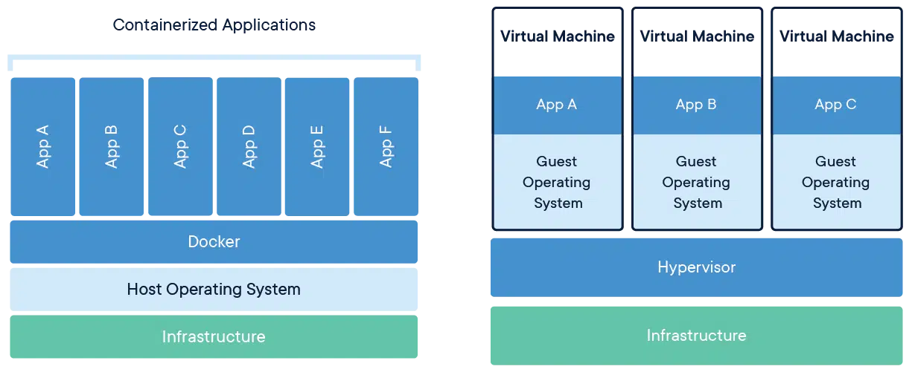

# Dockerとは

Dockerは、コンテナ仮想化を用いてアプリケーションを実行するためのOSSである。ここでは、Dockerを利用する上で理解しておきたい概念をざっくりと学ぶ。

## 仮想化とは

仮想化とは、メモリやCPU、ハードディスクといったコンピュータの限られたリソースを抽象化すること、及びその技術のことである。仮想化をすることで、１台の物理サーバー上で複数のOSを稼働させたり、逆に複数の物理サーバーを統合して１台のサーバーとして扱うこともできる。例えば、Windows上でLinux系のOSを実行するための仮想環境を構築するOSSとして[Oracle VM Virtual Box](https://www.virtualbox.org/)などが挙げられる。

## ハイパーバイザーとコンテナ
Dockerは「コンテナ型仮想化」と呼ばれる仮想化技術を採用している。前節で例に挙げたVirtual Boxは「ハイパーバイザー型仮想化」を用いている。例えば、Windows上でLinux系のOSの仮想環境を3つ動かしたいとしよう。ハイパーバイザー型仮想化では、ホストOS（Windows）上にゲストOS(Linux系OS)を3つインストールし、それぞれにリソースを割り振る。

コンテナ型仮想化の説明をするために、ハイパーバイザー型仮想化が比較対象として挙げられることが多い。このような画像を目にしたことがあるかもしれない。

出典: [docker.com "What is a Container?"](https://www.docker.com/resources/what-container/)

上の図は、コンテナ型（左）とハイパーバイザー型（右）それぞれの仮想化の仕組みを表している。コンテナ型仮想化では、コンテナ内のOSはホストOSを共有する。つまり、左図では6つのコンテナが起動しているが、ハイパーバイザー型と異なり、6つもOSをインストールする必要がなく、その分軽量である。一方で、ホストOSに依存する部分が大きく、利用できるOSは限られる。仮想化技術ごとに特徴があり、一長一短である。目的に応じて、適した仮想化技術を用いるのがいいだろう。

### なぜWindowsでLinux系コンテナが動作するのか
この節は興味がなければ、読み飛ばして構わない。前節で、コンテナ型仮想化はホストOSに大きく依存すると述べた。DockerのコンテナではLinux系のOSが動作している。ホストOSがWindowsだろうがMacOSだろうがコンテナで動くのはLinux系のOSである。これはコンテナ型仮想化の仕組みに矛盾している。なぜWindowsでLinux系コンテナが動作するのだろうか。

答えを先に述べると、単純なもので「ハイパーバイザー型仮想化でホストOS上にLinux系のOSの仮想環境を建て、その中でDockerを動かしている」のである。コンテナ型inハイパーバイザー型という訳だ。Linux系のOSにも様々な種類があるが、Linuxカーネル自体には互換性があり、OSに依存しない。

## Dockerの何が良いのか